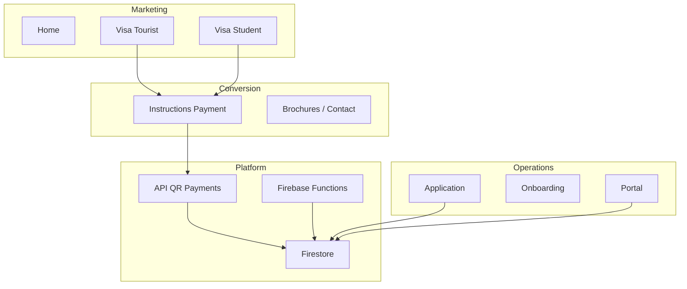

# Arquitectura del proyecto uDreamms

## Principio de organización

El repositorio es una **aplicación Next.js única** con backend embebido (API Routes + Firebase). No es un monorepo npm, pero sí una **separación lógica por carpetas**:

```
udreamms/
├── deploy/                        # Despliegue: Vercel, Firebase, env, checklist
├── docs/                          # Documentación (inversores, pagos Firestore)
├── functions/                     # Backend desplegable: WhatsApp, webhooks, callables
├── public/                        # Assets estáticos
├── src/
│   ├── app/                       # CAPA DE RUTAS (Next.js App Router)
│   ├── backend/                   # CAPA SERVIDOR (sin UI)
│   ├── frontend/                  # Módulos UI organizados + legacy
│   ├── components/                # UI compartida (landing, payments, ui)
│   ├── hooks/
│   └── lib/                       # Utilidades cliente + re-exports de compatibilidad
└── firebase.json, firestore.rules, storage.rules
```

## Capas y responsabilidades

### 1. `src/app/` — Enrutamiento

Solo **páginas finas** y **API Routes**:

| Ruta | Módulo |
|------|--------|
| `/` | Marketing home |
| `/visas/tourist` | Landing turista |
| `/visas/student` | Landing estudiante |
| `/instructions-payment-*` | Checkout instructivo |
| `/portal` | Auth usuarios |
| `/application/[id]`, `/onboarding/[id]` | Formularios operativos |
| `/api/payments/qr/*` | Backend pagos crypto |
| `/api/whatsapp/send` | Envío WhatsApp desde web |

Cada landing de visa tiene:

- `_components/` — secciones **visibles**
- `secciones-ocultar/` — secciones **guardadas**, no montadas (ver README en cada carpeta)

### 2. `src/backend/` — Lógica de servidor

| Ruta | Contenido |
|------|-----------|
| `firebase/admin.ts` | Firebase Admin SDK |
| `payments/` | Catálogo de planes, esquema Firestore, QR Solana, verificación |

Las rutas en `src/app/api/` deben importar desde `@/backend/...`.

`src/lib/payments/*` y `src/lib/firebase-admin.ts` re-exportan por **compatibilidad** con imports antiguos.

### 3. `src/frontend/` — Organización de producto

| Ruta | Contenido |
|------|-----------|
| `modules/marketing/home/secciones-ocultar/` | Bloques del home comentados |
| `modules/visas/` | Documentación de módulo (las páginas viven en `app/`) |
| `legacy/suite/` | React Flow, chatbot builder CSO (sin rutas activas) |

`src/components/` sigue siendo la biblioteca UI principal (landing, payments, shadcn).

### 4. `functions/` — Backend Firebase

Paquete Node independiente (`npm run deploy:functions`):

- Webhooks WhatsApp y Google Forms
- Callables de mensajería
- Acciones kanban (`moveCard`)

Comunicación con el mismo proyecto Firebase que la web.

## Flujo de datos — Pagos crypto

1. Cliente abre checkout en página de instrucciones.
2. `POST /api/payments/qr/create` → `backend/payments/qr-payment` crea sesión en Firestore.
3. Cliente escanea QR (Solana Pay URL).
4. `GET /api/payments/qr/status` consulta confirmación on-chain / Firestore.
5. Comprobante y notificación interna (email / WhatsApp según configuración).

Detalle de colecciones: `docs/firestore-crypto-payments.md`.

## Flujo de datos — Auth y aplicaciones

- **Portal:** Firebase Auth en cliente (`src/lib/firebase.ts`).
- **Application / Onboarding:** lectura/escritura Firestore desde páginas cliente.

## Alias TypeScript

```json
"@/*"        → src/*
"@/frontend/*" → src/frontend/*
"@/backend/*"  → src/backend/*
```

## Convenciones para el equipo

1. **Nueva lógica de servidor** → `src/backend/`, nunca en componentes `.tsx` de marketing.
2. **Nueva sección experimental** → `secciones-ocultar/` de la ruta; activar en `page.tsx` cuando esté lista.
3. **UI reutilizable** → `src/components/` (o subcarpeta `ui/` para primitivos).
4. **No borrar legacy suite** sin decisión de producto; está aislado en `frontend/legacy/suite/`.

## Diagrama de módulos de negocio



## Despliegue (separado del código de producto)

Toda la guía operativa está en **`deploy/`** (no mezclar con `src/`):

| Plataforma | Contenido desplegado | Documentación |
|------------|----------------------|---------------|
| **Vercel** | Next.js + API Routes | [deploy/platforms/vercel.md](../deploy/platforms/vercel.md) |
| **Firebase** | Firestore, Auth, Storage, Functions | [deploy/platforms/firebase.md](../deploy/platforms/firebase.md) |
| **Firebase Studio / IDX** | Solo desarrollo (`.idx/dev.nix`) | [deploy/platforms/firebase.md](../deploy/platforms/firebase.md) |

Variables: [deploy/env/](../deploy/env/) · Checklist: [deploy/CHECKLIST.md](../deploy/CHECKLIST.md).

Los archivos `firebase.json`, `firestore.rules` y `functions/` permanecen en la **raíz** por requisito del CLI de Firebase; `deploy/config/MANIFEST.md` los cataloga.

## Próximos pasos recomendados (escalabilidad)

- Agrupar rutas con `(marketing)` / `(product)` en App Router.
- Extraer servicios Firestore de application/onboarding a `backend/services/`.
- Proyecto Firebase de **staging** separado de `udreamms-platform-1`.
- Monorepo opcional: `apps/web` + `packages/backend` si se separan equipos.
