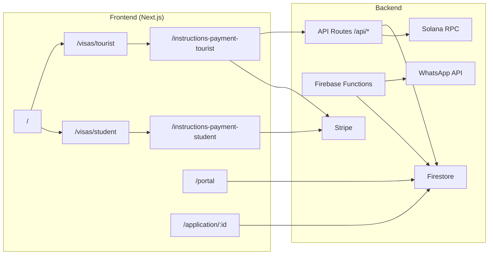

# uDreamms — Resumen para inversores

## Qué es

**uDreamms** es una plataforma digital de servicios migratorios y experiencias en Estados Unidos. Combina:

1. **Marketing y conversión** — landings de visa turista (B1/B2) y estudiante (F-1), home corporativo, brochures y contacto.
2. **Pagos** — Stripe (tarjeta) y cripto (Solana: USDC, USDT, SOL, LXR) con QR y confirmación en Firestore.
3. **Operaciones** — formularios de aplicación, onboarding por enlace, portal con autenticación Firebase.
4. **Automatización** — Firebase Functions (WhatsApp Cloud API, webhooks de Google Forms, acciones de kanban).

## Propuesta de valor

- Reduce fricción entre **descubrimiento → elección de plan → pago → seguimiento**.
- Catálogo de planes con precios públicos y descuentos por pago en crypto.
- Infraestructura lista para escalar campañas (múltiples landings, A/B de secciones ocultas sin tocar producción).

## Cómo interactúa el producto (flujo principal)

### Paso a paso (cliente turista)

1. Entra a `/visas/tourist`, compara planes y hace clic en **Elegir plan**.
2. Llega a `/instructions-payment-tourist?plan=...`, elige crypto o tarjeta.
3. **Crypto:** API crea sesión + QR → cliente paga en Phantom → estado en Firestore → comprobante y contacto de asesor.
4. **Tarjeta:** redirección a Stripe Checkout (enlace por plan).

### Paso a paso (cliente estudiante)

Mismo patrón en `/visas/student` → `/instructions-payment-student`.

## Stack tecnológico

| Capa | Tecnología |
|------|------------|
| Web | Next.js 16, React 18, Tailwind, shadcn/ui |
| Auth / DB | Firebase Auth, Firestore, Storage |
| Pagos fiat | Stripe |
| Pagos crypto | Solana Pay, SPL tokens |
| Serverless | Firebase Functions (`functions/`) |
| Deploy | Vercel (web) + Firebase (rules, functions, hosting opcional) |

## Modelo de ingresos (referencia en producto)

Planes publicados en landings (ej. turista básico ~$380 crypto / $494 tarjeta; premium y VIP a mayor ticket). El código centraliza montos en `src/backend/payments/payment-config.ts`.

## Diferenciadores técnicos

- **Secciones modulares** con carpeta `secciones-ocultar` por ruta para activar funnels sin redeploy masivo de lógica.
- **Backend separado** en `src/backend/` (pagos, admin Firebase) vs **frontend** en `src/app` + `src/components` + `src/frontend/modules`.
- Documentación de arquitectura en `docs/ARCHITECTURE.md`.

## Riesgos y deuda conocida

- Módulo **legacy suite** (automatización CSO / React Flow) sin rutas activas; conservado en `src/frontend/legacy/suite/`.
- Redirects en `next.config` a `/suite/*` sin páginas implementadas.
- Parte de la lógica de aplicación/onboarding vive en componentes cliente con Firestore directo (candidato a extraer a servicios backend).

## Documentación relacionada

- [ARCHITECTURE.md](./ARCHITECTURE.md) — estructura de carpetas y módulos
- [../deploy/README.md](../deploy/README.md) — despliegue Vercel + Firebase (Studio, BD, Functions)
- [../src/backend/README.md](../src/backend/README.md) — API y pagos
- [../src/frontend/README.md](../src/frontend/README.md) — UI y módulos visibles/ocultos
